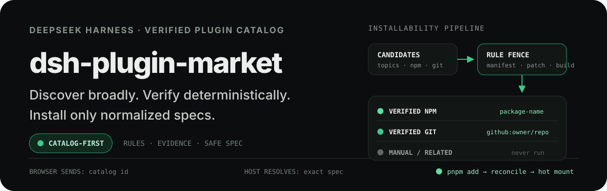

<p align="right">
  <strong>English</strong> · <a href="./README_ZH.md">简体中文</a>
</p>

<p align="center">
  
</p>

<p align="center">
  <a href="https://www.npmjs.com/package/@nanmicoder/dsh-plugin-market"></a>
  <a href="https://dsh-plugin-market-flax.vercel.app/"></a>
  <a href="./LICENSE"></a>
  
</p>

## Find the real plugins. Install the safe ones.

`dsh-plugin-market` adds a plugin marketplace to DeepSeek Harness. Browse a continuously curated catalog inside **Settings → Plugin Marketplace**, inspect the evidence behind each entry, and install or remove verified plugins without leaving the Web UI.

The catalog is deliberately conservative: deterministic rules decide whether an artifact is installable; model-generated summaries and tags are display-only and never authorize an install.

**[Open the interactive WebUI preview](https://dsh-plugin-market-flax.vercel.app/)** to search the real catalog slice, inspect evidence, and test the responsive product flow without executing an installation.

### Current catalog proof

The repository snapshot generated on 2026-08-15 contains:

| Catalog entries | One-click installable | Verified on npm | Verified from source |
| ---: | ---: | ---: | ---: |
| **3,518** | **936** | **716** | **220** |

Every one-click action executes a normalized package spec from the catalog—not a shell command copied from a repository README.

## Why Plugin Market?

| Capability | What it changes |
| --- | --- |
| **Verified install paths** | npm manifests, DSH bundle metadata, patch files, and build readiness are checked before an entry becomes installable. |
| **Long-tail discovery** | Search repository names, packages, categories, author topics, and controlled catalog tags instead of relying on stars alone. |
| **Explainable results** | Repository description, model summary, topics, metrics, license, release data, and install evidence stay visibly separate. |
| **Safe-by-construction installs** | The browser sends only a catalog ID; the host resolves and validates the exact npm or GitHub spec before invoking pnpm. |
| **Immediate runtime feedback** | Host-only plugins hot-mount after install; plugins with a Web UI need only a page refresh. |

## Install

> [!NOTE]
> Requires an existing [DeepSeek Harness](https://github.com/deepseek-ai/deepseek-harness) installation.

### npm

```sh
dsh plugin --profile web add @nanmicoder/dsh-plugin-market
```

Validate the composed profile, restart DSH, and open the Web UI:

```sh
dsh --profile web --dump-config
dsh web
```

Then open **Settings → Plugin Marketplace**.

### Build from source

```sh
git clone https://github.com/NanmiCoder/dsh-plugin-market.git
cd dsh-plugin-market
pnpm install
pnpm build
dsh plugin --profile web add .
```

Run `pnpm build` again after changing the source. The local plugin install remains linked to this checkout.

## How it works

1. The crawler discovers repositories from the `dsh-plugin`, `deepseek-harness`, and `dsh` GitHub topics.
2. GitHub metadata, root and workspace manifests, patch files, README content, releases, and npm registry manifests are collected.
3. Deterministic rules assign one of four trust tiers and derive the only spec that may be executed.
4. The model adds a concise summary, category, tags, and the author's stated install hint. These fields never change the tier or executable spec.
5. Versioned catalog artifacts are published under `data/v1/`; the plugin refreshes them with ETag requests and keeps a local cache.
6. The Web UI merges catalog entries with the active profile's installed state. An install sends only an entry ID back to the host.
7. The host looks up that ID in its own catalog, validates the normalized spec, runs `pnpm add`, reconciles `dsh.profile.bundles`, and hot-mounts the plugin row.

## Trust model

| Tier | Required evidence | Marketplace behavior |
| --- | --- | --- |
| `verified-npm` | The npm registry manifest declares `dsh.bundle`. | One-click install from the exact published package name. |
| `verified-git` | The repository declares `dsh.bundle`, has a valid `cordis.patch.yml`, and can build during Git installation. | One-click install from `github:owner/repo`, with a build-script warning. |
| `likely-plugin` | Plugin signals exist, but unattended installation cannot be proven. | Browse and copy manual clone/build steps. |
| `related` | Ecosystem project without a mountable DSH bundle. | Browse only. |

### README hints are evidence, not commands

Each entry keeps two values separate:

| Field | Source | Executed? |
| --- | --- | --- |
| `installSpec` | Deterministic npm/Git classification | **Yes**, after the host safety gate |
| `installHint.command` | Author README, extracted by the model | **No**, display-only |

This prevents hard-coded profile names, template placeholders, shell metacharacters, and stale package names in README prose from entering the execution path.

## Marketplace experience

- Filter one-click entries, the full catalog, or already installed plugins.
- Search across repository names, package names, topics, categories, and controlled tags.
- Open a detail panel for full repository metrics, install evidence, and the source README.
- See exactly which command the marketplace will execute before confirming.
- Install, uninstall, and reconcile the active profile without editing its manifest by hand.
- Switch the plugin to browse-only mode with `allowInstall: false`.

README files are fetched on demand through a catalog-ID route. The renderer builds React elements rather than using `dangerouslySetInnerHTML`, and links and images are limited to safe HTTP(S) URLs.

## Configuration

| Field | Default | Purpose |
| --- | --- | --- |
| `registryUrl` | `''` | Catalog source. Falls back through repository `data/v1/catalog.json`, local cache, then the packaged seed snapshot. npm installs normally begin with the seed until a remote URL is configured. |
| `refreshIntervalHours` | `6` | Background refresh interval. Use `0` to disable scheduled refreshes. |
| `allowInstall` | `true` | Set to `false` to reject all install/uninstall mutations and keep browsing only. |
| `profileDir` | inferred from `ctx.baseUrl` | Escape hatch for non-standard profile layouts; normally leave unset. |

```yaml
- insert:
    - id: plugin-hub
      name: '@nanmicoder/dsh-plugin-market'
      config:
        registryUrl: ''
        refreshIntervalHours: 6
        allowInstall: true
```

## Boundaries

- Installing a third-party plugin executes third-party code on your machine. The confirmation dialog exposes repository, author, license, package source, and build-script risk before any change.
- Deterministic verification proves packaging and installability, not that a third-party plugin is benign. Review unfamiliar code before installing it.
- The npm package includes a small seed catalog, not the multi-megabyte live dataset. Configure `registryUrl` when deploying against a separately published catalog.
- Host routes use `/plugin-hub/*`. They intentionally stay outside `/plugins/<package-id>`, which DSH reserves for client bundles.
- The UI registers into `settings.section` for compatibility with DSH builds that do not expose `settings.plugins.tab`.

## Catalog development

```sh
cp .env.example .env          # add ANTHROPIC_API_KEY for model labels
pnpm crawl:dry                # full crawl into .tmp/, without changing data/
pnpm crawl:rules              # deterministic classification only
pnpm crawl                    # crawl, classify, and label
pnpm refresh                  # refresh and push only when content changes
```

Install hints are extracted with the Anthropic SDK. The default DeepSeek-compatible endpoint and model can be overridden with `LLM_BASE_URL` and `LLM_MODEL`; classification remains rule-based regardless of the model provider.

## Development

```sh
pnpm install
pnpm typecheck
pnpm build
pnpm verify
pnpm site:dev
pnpm site:build
npm pack --dry-run --ignore-scripts
```

`pnpm verify` runs offline catalog, install-safety, request-trust, crawler, labeling, artifact, and package-contract checks.

Every pushed commit is type-checked, built, and deployed through Vercel's Git integration. `main` updates production; other branches receive preview deployments.

## Releasing

Normal commits and pushes never publish npm packages. A release tag must exactly match `package.json`:

```sh
pnpm version patch --no-git-tag-version
git add package.json pnpm-lock.yaml
git commit -m "chore: release v$(node -p \"require('./package.json').version\")"
git push origin main
git tag "v$(node -p \"require('./package.json').version\")"
git push origin --tags
```

The `publish.yml` workflow rebuilds from source, verifies the package and tarball, then publishes through npm Trusted Publishing (OIDC). No long-lived `NPM_TOKEN` is required.

## License

[MIT](./LICENSE)
